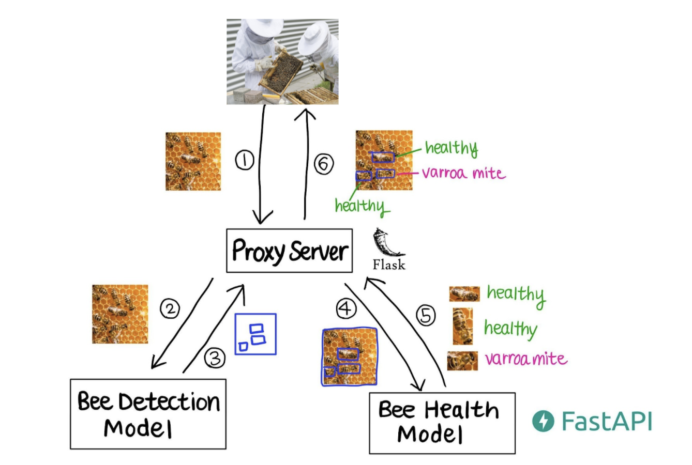

# Honeybee Health AI

## I. Overview
Honeybee Health AI is a machine learning based web application that predicts health of the honeybees from beehive images. Our web application first runs a pre-trained object detection model to detect individual bees from the hive image, and then runs a convolutional neural network model we trained to predict the health of an individual bee. We built our ML product as microservices and deployed our containerized services to Google Cloud Platform (GCP) Cloud Run.

You can visit our web application here: https://bee-proxy-server-7w6n2246cq-uk.a.run.app/

Click on the image below to watch the demo video of our web application:

## II. Machine Learning Models
### 1. Bee Detection Model
Bee detection model API: https://bee-detection-model-7w6n2246cq-uk.a.run.app/docs

To detect individual bees from a beehive image, we used a pre-trained object detection model called [MobileNet V2](https://tfhub.dev/google/openimages_v4/ssd/mobilenet_v2/1), which is published by Google and was trained on 14.7M bounding boxes from 1.74M images with 600 object classes including "bee."

### 2. Bee Health Model
Bee health model API: https://bee-health-model-7w6n2246cq-uk.a.run.app/docs

The model for predicting bee health has been trained on ~5000 single bee images with 5 target values: `healthy`, `varroa mites`, `ant problems`, `hive being robbed`, and `missing queen`. The data comes from the Kaggle platform and is in the form of images that have been cropped from a video file. The model achieves high predictive performance with metrics like acccuracy and f1 score being 0.97 and 0.90 respectively. While the performance is quite high, in this project it is important to control for false negative - reporting healthy bee while it is actually being infected.

## III. Microservices Architecture
Honeybee Health AI consists of three microservices: **bee detection model server**, **bee health model server**, and **proxy server** to handle web requests.

Below is a diagram of how our microservices communicate via API to provide bee health predictions to honeybee farmers.

1. Honeybee farmer visits our website and submits a beehive image. 
2. Proxy server sends the beehive image to the bee detection model server. 
3. Bee detection model server detects individual bees from the beehive image and sends bounding box coordinates back to proxy server as JSON. 
4. Proxy server then sends beehive information and bounding box coordinate information of the detected bees to bee health model server.
5. Bee health model server predicts health for each cropped bee in the image, and sends back results to proxy server as JSON.
6. Proxy server processes the results and provides a health report to the honeybee farmers in HTML.

## IV. Tutorial
### 1. How to run servers locally
#### Models (FastAPI)
1. Navigate to `src/bee_detection_model` for bee detection model server, or `src/bee_health_model` for bee health model server. 

2. In the local terminal, run: 

#### Proxy Server (Flask)

`src/proxy_server`

### 2. How to build and run docker containers locally

1. Navigate to the app directory and type: `./docker_run.sh`. This bash script will:
    1. stop currently running Docker container if it already exists
    2. build new Docker image using Dockerfile
    3. create and run a Docker container using the built Docker image.

2. To check whether Docker container is running properly (and to find out the name of the running container), type `docker ps`. If you see any error status, type `docker logs <NAME>` to fetch logs for the container. To inspect the insides of currently running container (aka navigate Docker container instance with CLI), type `docker exec -it <NAME> /bin/bash`.

3. Visit `localhost:8000` to test your application running on your local computer.

4. To stop the Docker container, type `docker stop <NAME>`. 

5. When you are finished with testing Docker containers locally, make sure to remove unused containers and images by typing `docker system prune`. These unused containers and images will take up lots of space if they are not removed.

### 3. How to deploy on Google Cloud Platform's Cloud Run
1. First we need to build our Docker container image using Cloud Build and register to Google Container Registry (GCR). In the local terminal, navigate to the app directory and run: `gcloud builds submit --tag gcr.io/<PROJECT_ID>/<container-name>`

2. Let's now deploy the Docker container image on the cloud. Run: `gcloud run deploy --image gcr.io/<PROJECT-ID>/<container-name> --platform managed`. 
You will then be prompted to enter service name, region, and allow for unauthentications invocations. Press `y` to allow public access to the URL. You will get a URL to your ML application running on the cloud!

## V. References
1. Deploy Docker Container to GCP - https://towardsdatascience.com/deploy-a-dockerized-fastapi-app-to-google-cloud-platform-24f72266c7ef
